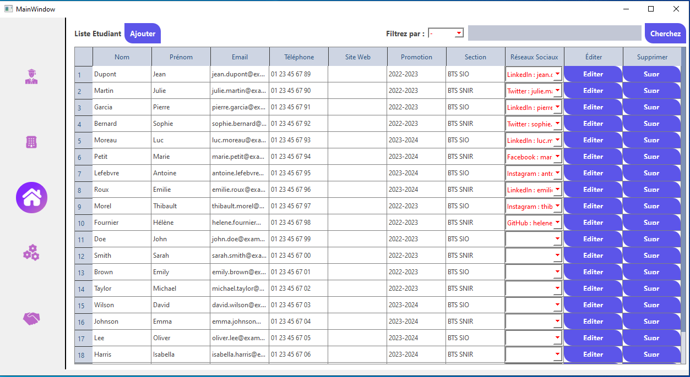
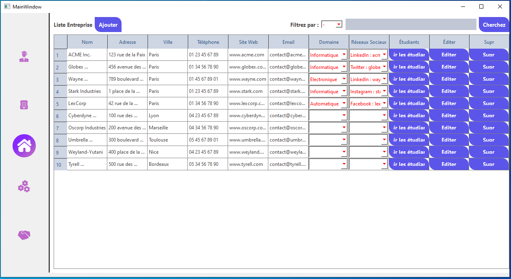
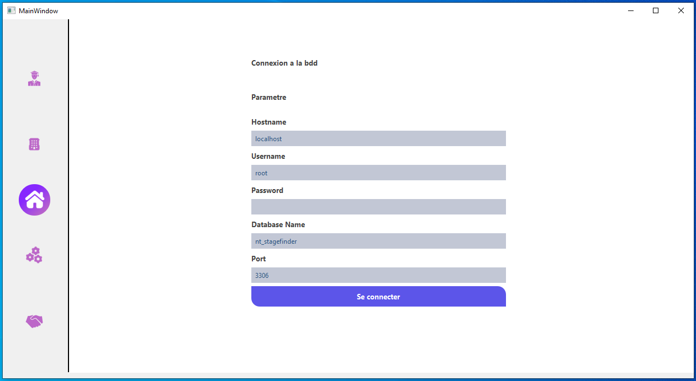

# StageFinder - Gestion de Stages pour Étudiants

## 📘 À propos
StageFinder est une application QT développée en C++ pour aider les étudiants et les entreprises à gérer et trouver des stages. Ce projet utilise une base de données MySQL et suit les principes de conception UML, MVC et DAO.

## 📚 Prérequis
- QT (C++)
- Base de données MySQL
- Conception UML
- Architecture MVC / DAO

## 🛠️ Fonctionnalités et Outils

### Version Locale (IHM)
- **Profil d'étudiant (Gestion)** :
  - Nom, Prénom, Date de naissance
  - Contact (Email, Téléphone, Site web)
  - Promotion et section (SNIR / SIO)
  - Réseaux sociaux
- **Détails d'entreprise (Gestion)** :
  - Nom, Adresse, Contact
  - Description / Domaine d'activité
  - Liste d'étudiants ayant déjà effectué un stage

### CRUD pour les étudiants et les entreprises
- Ajouter, Rechercher, Modifier, Supprimer des profils d'étudiants ou d'entreprises

### Configuration BDD
- Interface pour configurer la connexion à la base de données MySQL

## 📸 Captures d'écran
### Profil d'Étudiant

### Détails d'Entreprise

### Configuration Base de Données

### Création de Stage

---

👨‍💻 Développé avec passion dans le cadre du Travaux Pratiques 3
